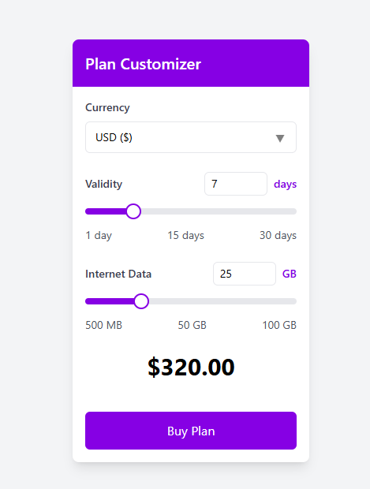

# WooCommerce Plan Customizer



A powerful WooCommerce plugin that enables customers to customize mobile data plans with flexible validity periods and data allowances.

## Features

- **Dynamic Plan Customization**

  - Adjustable validity period (1-30 days)
  - Flexible data allocation (500MB - 100GB)
  - Real-time price calculation
  - Multiple currency support (USD, EUR, GBP)

- **User-Friendly Interface**

  - Modern, responsive design
  - Intuitive slider controls
  - Real-time price updates
  - Mobile-friendly layout

- **Admin Features**
  - Comprehensive order management
  - Detailed order tracking
  - Customizable pricing rules
  - Order history and analytics

## Installation

1. Upload the `wc-plan-customizer` folder to the `/wp-content/plugins/` directory
2. Activate the plugin through the 'Plugins' menu in WordPress
3. Configure the plugin settings under 'Plan Customizer > Settings'

## Usage

### Shortcode

Add the plan customizer to any page or post using the shortcode:

```
[plan_customizer]
```

### Product Setup

The plugin automatically creates a "Customizable Data Plan" product with the following configurations:

- Product Type: Simple
- Virtual: Yes
- Sold Individually: Yes
- Base Price: Configurable in settings

### Admin Settings

Configure pricing rules under 'Plan Customizer > Settings':

- Base Price: Starting price for plans
- Price per GB: Additional cost per GB
- Price per Day: Additional cost per day

## Pricing Calculation

The final price is calculated using the formula:

```
Final Price = Base Price + (Days - 7) * Price per Day + (Data - 25GB) * Price per GB
```

## Requirements

- WordPress 5.8 or higher
- WooCommerce 5.0 or higher
- PHP 7.4 or higher

## Customization

### CSS Classes

Key CSS classes for styling:

- `.wc-plan-customizer`: Main container
- `.plan-customizer-header`: Header section
- `.plan-customizer-body`: Main content area
- `.customizer-field`: Individual form fields
- `.price-display`: Price display section

### Filters and Actions

Available hooks for extending functionality:

```php
// Modify base price
add_filter('wc_plan_customizer_base_price', 'custom_base_price', 10, 1);

// Modify price calculation
add_filter('wc_plan_customizer_calculated_price', 'custom_price_calculation', 10, 3);

// After plan customization
do_action('wc_plan_customizer_after_add_to_cart', $cart_item_data);
```

## Support

For support inquiries:

1. Check the documentation
2. Visit the support forum
3. Submit issues through the plugin's support channel

## License

This plugin is licensed under the GPL v2 or later.

```
This program is free software; you can redistribute it and/or
modify it under the terms of the GNU General Public License
as published by the Free Software Foundation; either version 2
of the License, or (at your option) any later version.
```

## Changelog

### 1.0.0

- Initial release
- Basic plan customization features
- Admin dashboard
- Order tracking system
- Multiple currency support

## Credits

Developed by Sabbir Ahmed
Icons and design elements from various open-source projects


